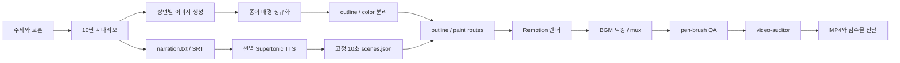

# storybook-full-touch-video 신규 스킬 도입 검토서

## 1. 결론

신규 스킬 이름은 **`storybook-full-touch-video`가 적합하다.**

- `storybook`: 시나리오, 캐릭터, 장면 연속성, 동화 낭독을 담당한다.
- `full-touch`: 단순 완성 이미지가 아니라 펜 경로와 채색 경로가 최종 그림을 빠짐없이 재현할 수 있는 입력 자산을 뜻한다.
- `video`: 이미지 생성에서 끝나지 않고 SRT, TTS, BGM, Remotion 렌더, QA, MP4 전달까지 포함한다.

다만 `full-touch`는 일반 사용자에게 익숙한 용어가 아니므로 스킬 설명과 UI에는 **“펜 외곽선→브러시 채색이 가능한 동화 영상”**이라는 설명을 항상 함께 사용한다.

**도입 상태: 프로젝트 정식 v0.1 승인.** 핵심 제작과 QA는 실물 100초 쇼츠로 검증됐고, 프로젝트 스킬 카탈로그·설치 스크립트·현장 로그에 정식 등록했다. 프로젝트 리포를 유일한 소스로 유지하고 설치 시에는 symlink만 생성한다.

## 2. 검토 범위

이번 검토는 다음 실제 제작 흐름 전체를 기준으로 했다.

1. 자유 주제 동화 기획
2. 10씬 시나리오 작성
3. 100초 SRT 구성
4. 세로형 풀터칭 이미지 10장 생성
5. 이미지 종이 배경 정규화
6. Supertonic 장면별 TTS (검증본 F1, 신규 권장 `female-08`)
7. 펜 외곽선→브러시 채색 경로 생성
8. 피아노 BGM과 내레이션 덕킹
9. 1080×1920 Remotion 렌더
10. 경계 하드컷 수정
11. 수치 QA와 독립 video-auditor
12. 최종 MP4·SRT·콘택트시트·리포트 전달

검증 프로젝트:

- 프로젝트: `projects/star-seed-fairy-tale-100s`
- 최종 영상: `output/star-seed-fairy-tale-100s.mp4`
- 데이터/QA: `data/star-seed-fairy-tale-100s`

## 3. 스킬의 역할과 기존 스킬과의 차이

### 기존 스킬

| 스킬 | 담당 범위 |
|---|---|
| `brush-director` | 일반 영상 요청을 연출 브리프와 YAML로 변환 |
| `pen-brush-video` | 완성 이미지에서 외곽선·색 레이어와 경로를 생성해 렌더 |
| `shorts-brush` | 1080×1920 세로 포맷과 쇼츠 전환·세이프존 |
| `video-auditor` | 최종 MP4의 규격·경계·오디오·라이선스 검사 |
| `brush-qa-review` | 씬별 시각 검토와 수정 요청 |

### 신규 스킬

`storybook-full-touch-video`는 위 기능을 복사하지 않고 동화 제작에 필요한 앞단과 연결 계약을 추가한다.

- 이야기 구조와 교훈
- 캐릭터 고정 규칙
- 장면별 이미지 생성 프롬프트
- 풀터칭 이미지 입력 계약
- 1이미지=1씬, 2문장 cue=1씬 매핑
- 장면별 고정 길이 Supertonic 합성
- 동화용 BGM·덕킹 기본값
- 모든 QA를 통과한 뒤 전달하는 완성 기준

즉, **새 렌더러가 아니라 동화 제작 오케스트레이터**다.

## 4. 입력 계약

최소 입력:

- 주제 또는 교훈
- 포맷: `shorts` 또는 `youtube`
- 전체 시간
- 씬 수

선택 입력:

- 캐릭터 레퍼런스
- 기존 영상 또는 이미지
- 사용자 SRT
- 지정 음성
- 지정 BGM
- 색상·화풍

기본값:

| 항목 | 기본값 |
|---|---|
| 포맷 | Shorts 1080×1920 |
| FPS | 30 |
| 구조 | 10씬 × 10초 |
| 총 길이 | 100초 |
| 이미지 | 씬당 1장 |
| 자막 | 씬당 2 cue |
| TTS | 검증본 Supertonic F1 (호환 별칭), 신규 권장 `female-08` |
| 문장 쉼 | 350ms |
| 드로잉 | `pen-brush`, `sync:auto` |
| BGM 덕킹 | 10dB, 100ms/500ms |

## 5. 출력 계약

```text
projects/<id>/scenario.md
projects/<id>/narration.txt
projects/<id>/subtitles.srt
projects/<id>/project.yaml
projects/<id>/public/bg/scene-*.png
projects/<id>/contact-sheet.png

data/<id>/scenes.json
data/<id>/props.json
data/<id>/tts/narration.wav
data/<id>/tts/narration.srt
data/<id>/qa/pen-brush-report.json
data/<id>/qa/gallery.html
data/<id>/audit/audit-report.md

output/<id>.mp4
```

최종 응답에는 MP4 직접 실행 링크, 이미지 콘택트시트, 진행 프레임 갤러리, SRT, 감사 리포트를 포함한다.

## 6. 제작 파이프라인



## 7. 풀터칭 이미지의 실제 의미

초기 실패의 핵심은 일반적인 완성형 동화 일러스트를 바로 드로잉 자산으로 사용하려 한 것이다. 전체 밤하늘과 숲을 가득 칠한 풀블리드 이미지는 보기에는 좋지만 자동 외곽선·채색 경로에 부적합하다.

풀터칭 자산은 다음 조건을 만족해야 한다.

- 화면 외곽과 연결된 균일한 종이 영역
- 닫힌 짙은 외곽선
- 인접 색면의 선 분리
- 중대형 의미 객체
- 캐릭터와 핵심 소품의 독립 영역
- 파티클·안개·그라디언트 최소화
- 펜과 브러시가 지나갈 의미 있는 경로
- 최종 채색 누락 픽셀 0

### 종이색 주의

이미지 생성기가 만든 따뜻한 아이보리에는 채도와 미세 질감이 있어 전체 배경이 색상 콘텐츠로 검출됐다. 실제 빌드 오류는 다음과 같았다.

```text
pen-brush 레이어 분리 실패: 종이 배경을 식별할 수 없는 full-bleed 이미지
```

해결:

- 외곽에 연결된 밝고 저채도 영역만 종이로 판정
- 닫힌 외곽선 안의 크림색은 보존
- 종이를 `RGB(250,249,247)`로 정규화
- 이후 content fraction 29.07%~64.54%로 정상 분리

## 8. 이미지 생성 규칙

### 장면 생성 순서

1. 캐릭터가 가장 단순한 1씬을 먼저 생성한다.
2. 1씬을 캐릭터·선 굵기·팔레트 기준으로 고정한다.
3. 다음 장면은 승인된 앞 장면 1~2장을 레퍼런스로 사용한다.
4. 장면별 핵심 행동을 하나만 묘사한다.
5. 각 생성물을 1080×1920 또는 1920×1080으로 정규화한다.
6. 전체 콘택트시트로 캐릭터와 이야기 흐름을 확인한다.

### 금지

- 가로 그림을 세로로 크롭
- 화면 전체의 채색 배경
- 별가루·먼지·비 입자의 과다 생성
- 캐릭터 의상과 얼굴 변화
- 텍스트·로고·워터마크

## 9. 시나리오·자막 규칙

10씬 기본 이야기 기능:

| 씬 | 역할 |
|---:|---|
| 1 | 세계와 사건 |
| 2 | 발견 |
| 3 | 선택 |
| 4 | 실패·기다림 |
| 5 | 재도전 |
| 6 | 위기·용기 |
| 7 | 보상 시작 |
| 8 | 마법의 절정 |
| 9 | 공동체 확산 |
| 10 | 결말과 교훈 |

`narration.txt`는 한 줄을 한 씬으로 사용한다. 한 줄에는 두 문장을 권장한다. 수동 SRT는 씬당 2 cue로 분리해 모바일 가독성을 확보한다.

## 10. TTS와 정확한 100초

전역 TTS를 100초로 강제하면 장면마다 말의 속도가 달라지거나 문장이 경계를 넘을 수 있다. 신규 스킬은 장면별로 독립 합성한다.

```text
scene = 10.0s
lead = 0.4s
tail = 0.6s
max speech = 9.0s
```

- 9초 이하는 자연 속도 유지
- 9초 초과는 장면별 미세 보정
- 필요 속도 `>1.15×`면 대본 축약
- 각 장면을 정확히 10초로 패딩
- 최종 음성 100초, 영상 3,000프레임

실제 마지막 장면은 10.59초가 나와 대본을 축약한 뒤 9초 안으로 맞췄다.

## 11. 렌더와 전환

펜·브러시 단계:

1. outline route와 펜 커서
2. 문장 경계 부근에서 핸드오프
3. paint route와 브러시 커서
4. 원본 선 굵기 복원
5. 마지막 18프레임 종이 워시

### 발견된 공용 엔진 갭

`pen-brush`는 `DrawingPhaseLayer`를 사용하지만 기존 outro 워시는 `RevealLayer`에만 있었다. 그래서 8개 경계가 FAIL이었다.

- 최초 경계 최대 diff: 22.09%
- 수정: `DrawingPhaseLayer`에 공용 outro 적용
- 최종 경계 최대 diff: 4.48%
- 최종 audit: PASS

신규 스킬 도입 시 이 수정은 필수 기반으로 유지한다.

## 12. QA 계약

### 경로 QA

- outline coverage ≥ 0.99
- paint coverage ≥ 0.9999
- paint missing pixels = 0
- color leak = 0
- cursor overlap = 0
- phase timing valid = true

### 영상 QA

- 규격과 프레임 수 일치
- 자막 쇼츠 세이프존
- 경계 diff < 6%
- 무음 아님
- 약 -16 LUFS
- True Peak 안전 범위
- BGM 라이선스 매니페스트 존재
- auditor FAIL 0

### 검증 예제 결과

| 지표 | 결과 |
|---|---:|
| 규격 | 1080×1920, 30fps |
| 길이 | 100.000초 |
| 프레임 | 3,000 |
| outline | 0.9948–0.9967 |
| paint | 1.0 전 씬 |
| 누락 픽셀 | 0 전 씬 |
| 경계 diff | 최대 4.48%, 평균 4.38% |
| Integrated | -16.16 LUFS |
| True Peak | -2.33 dBTP |
| 감사 | PASS, FAIL 0, WARN 1 |

WARN 1건은 BGM Content ID 등록 여부를 페이지 정보만으로 보장할 수 없다는 게시 전 확인 항목이다.

## 13. 구현 파일

### 신규 스킬 후보

```text
skill/storybook-full-touch-video/
├── SKILL.md
├── agents/openai.yaml
└── references/
    ├── full-touch-image-contract.md
    ├── story-srt-tts-contract.md
    ├── build-and-qa.md
    └── validated-example.md
```

### 공용 보조 스크립트

- `scripts/normalize-storybook-paper.py`
- `scripts/prepare-storybook-full-touch.py`

### 공용 엔진 수정

- `src/scene/DrawingPhaseLayer.tsx`: pen-brush outro 워시
- `src/scene/BrushScene.tsx`: outro 파라미터 전달
- `tests/drawing-phase.test.ts`: 마지막 실재 프레임 워시 테스트
- `bin/build.py`: 권장 전환 18프레임·불투명 워시

## 14. 도입 단계

### Phase 1 — 후보 확정

- [x] 실물 10씬 100초 제작
- [x] 이미지 생성 규칙 확인
- [x] 장면별 TTS 확인
- [x] 펜·브러시 QA 통과
- [x] 하드컷 수정 후 감사 PASS
- [x] 스킬 후보 폴더 생성
- [x] 공용 스크립트 초안 생성
- [x] 사용자 최종 도입 승인

### Phase 2 — 프로젝트 스킬 등록

- [x] `bin/install-skills.sh`에 symlink 항목 추가
- [x] README 스킬 카탈로그에 행과 상세 소절 추가
- [x] 전체 테스트 실행
- [x] `quick_validate.py` 통과
- [x] 설치 symlink 경로에서 `quick_validate.py` 스모크 테스트

### Phase 3 — 확장

- [ ] 16:9 60초 회귀 테스트
- [ ] 다른 캐릭터·다른 화풍 100초 테스트
- [ ] 30초/60초/180초 프리셋
- [ ] 이미지 일관성 점수 자동화
- [ ] 자막 줄 수·세이프존 OCR 검사
- [ ] Content ID 위험이 낮은 자체 BGM 프리셋

## 15. 리스크

| 리스크 | 영향 | 대응 |
|---|---|---|
| 이미지 생성의 캐릭터 변동 | 장면 연속성 저하 | 승인 장면 누적 레퍼런스와 불변 조건 |
| 생성 이미지의 종이 질감 | full-bleed 오인 | 외곽 연결 종이 정규화 |
| 긴 내레이션 | 장면 경계 침범 | 씬별 합성, 1.15× 한도, 대본 축약 |
| 조밀한 장면의 경로 비용 | 렌더 시간 증가 | 중대형 객체와 제한된 잎·파티클 |
| BGM Content ID | 게시 후 클레임 가능성 | 매니페스트 보존, 게시 전 확인 |
| Remotion/Zod 버전 경고 | 향후 호환성 위험 | 별도 의존성 정합 작업으로 관리 |

## 16. 최종 권고

`storybook-full-touch-video`는 기존 `pen-brush-video`를 대체하지 않는다. 동화 시나리오부터 풀터칭 이미지, 정확한 장면 TTS, 최종 QA까지 묶는 상위 제작 스킬로 도입한다.

권장 v0.1 범위:

- 10~180초
- 가로·세로 네이티브 이미지
- 장면별 1이미지
- Supertonic `female-08`, speed 1.10 기본 (기존 F1 검증본 호환)
- 펜→브러시 2단계
- 단일 BGM과 덕킹
- 정량 QA와 독립 감사

프로젝트의 정식 v0.1 스킬로 채택했다. 실행 코드와 계약 문서는 이 리포를 단일 진실로 유지하고, 외부 스킬 디렉터리에는 사본이 아니라 symlink만 설치한다.
